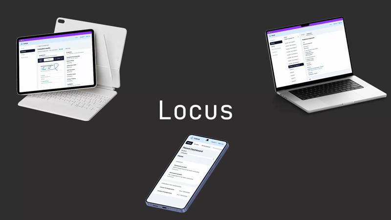

# Ray (Ryo) Ito | Full-Stack Developer

### Building Reliable Software Through System Design

I am a **Full-Stack Developer** specializing in **TypeScript, React, Next.js, Node.js, AI-powered systems, and modern cloud architecture**, with a strong focus on building reliable, maintainable, and type-safe applications.

Before transitioning into software engineering, I spent **15 years delivering mission-critical construction projects**, including large-scale data centers in Japan and Singapore. That experience shaped the way I approach software today—prioritizing system design, technical clarity, and long-term maintainability over short-term solutions.

- **Engineering Focus:** TypeScript, React, Next.js, Node.js, Kotlin, PostgreSQL, Supabase, Cloud Platforms
- **Specialization:** System Design, AI-powered Systems, Local-first Architecture, Type-safe Development
- **Background:** 15 years of project leadership delivering mission-critical infrastructure

[Portfolio](https://www.ryoito.dev/) | [LinkedIn](https://www.linkedin.com/in/ryo-ito46/)

---

## Technical Expertise

> **Building production-ready software systems with a focus on system design, AI-powered experiences, local-first architecture, type-safe development, and performance.**

### Core Technologies

### Frontend

React · Next.js · Vite · Tailwind CSS · React Native (Expo)

### Backend

Node.js · NestJS · Hono · Express · Prisma · Supabase · PostgreSQL · Firebase

### Mobile

Kotlin · Android · Wear OS

### AI

OpenAI API · AI Decision Systems

### Architecture & Infrastructure

Cloudflare Workers · Google Cloud Run · Cloud SQL · Docker · GitHub Actions · Vercel · AWS (S3/EC2)

### Engineering Focus

- System Design
- Local-first Architecture
- Type-safe Development
- API Design
- Performance Optimization
- Monorepo Architecture

## Featured Projects

  

### Locus | Local-first Learning Platform

> **A production-oriented learning platform built around local-first architecture, offline-first workflows, and reliable synchronization for modern classrooms.**

[**Live Demo**](https://locus-web.pages.dev/) | [**Source Code**](https://github.com/Carbon-RI/Locus) | [**Full Case Study**](https://www.ryoito.dev/projects/locus)

- **Local-first Architecture**: Built a Dexie-powered local data layer with Pull Sync, enabling reliable offline operation while keeping the server as the source of truth.
- **Offline PDF Workflow**: Implemented PDF annotation, assignment submission, and automatic synchronization across unstable network conditions.
- **Production-ready Backend**: Designed a scalable backend using Hono, Cloudflare Workers, Supabase, PostgreSQL, and Row Level Security.
- **System Design**: Documented architecture decisions, synchronization strategy, security model, and offline workflow through ADRs and technical design documentation.

---

### Voie | AI Wearable Assistant
*In Development*

> **An AI-powered wearable assistant exploring context-aware decision making and proactive interactions through Wear OS.**

- **Context-aware AI**: Designed a decision pipeline that combines user context and Assistant State to generate situation-aware AI guidance.
- **AI Decision Architecture**: Separated Context, AI Decision, and Presentation layers to keep factual grounding, reasoning, and device presentation independently testable.
- **Wear OS Experience**: Built an Android Gateway connecting the backend with a Pixel Watch through the Android Data Layer.
- **Backend & Cloud**: Built a NestJS, Prisma, and PostgreSQL backend deployed on Google Cloud Run and Cloud SQL.

---

### Impacto Live-Chat | Real-time Architecture Redesign

> **A complete architectural rebuild transforming a prototype chat application into a consistency-first real-time system.**

[**Live Demo**](https://impacto-live-chat.vercel.app/) | [**Source Code**](https://github.com/Carbon-RI/Impacto-live-chat) | [**Full Case Study**](https://www.ryoito.dev/projects/impacto-chat-redesign)

- **Database as SSoT**: Centralized all mutations through Supabase RPCs to eliminate client-side state divergence.
- **Atomic Transactions**: Removed TOCTOU race conditions by combining authorization and database writes into single transactional operations.
- **Reliable Real-time Updates**: Adopted PostgreSQL WAL-based subscriptions so the UI reflects only committed database state.
- **End-to-end Type Safety**: Generated TypeScript types directly from the database schema to improve maintainability and refactoring confidence.

---

## Team Projects

The following projects were developed as part of multidisciplinary teams. While the repositories are private, the architectural decisions and technical challenges are documented in the accompanying case studies.

### Dosis (MedTech) | Full-Stack Developer

[**Landing Page**](https://cubie-learning.wmdd.ca/) | [**Full Case Study**](https://www.ryoito.dev/projects/dosis)

- Designed a two-step medication validation workflow combining OCR and Drug Identification Numbers (DIN) to improve medical data reliability.
- Built a scheduling system using Expo and Agenda to deliver dependable medication reminders and interaction checks.

### Cubie (EdTech) | Technical Lead

[**Landing Page**](https://dosis-wmdd.netlify.app/) | [**Full Case Study**](https://www.ryoito.dev/projects/cubie)

- Led technical architecture for a team project, establishing monorepo standards and shared development conventions.
- Designed secure file handling with AWS S3 Presigned URLs and HttpOnly cookie authentication for educational data protection.
- Chose a lightweight React + Vite architecture to maximize maintainability and team productivity.
